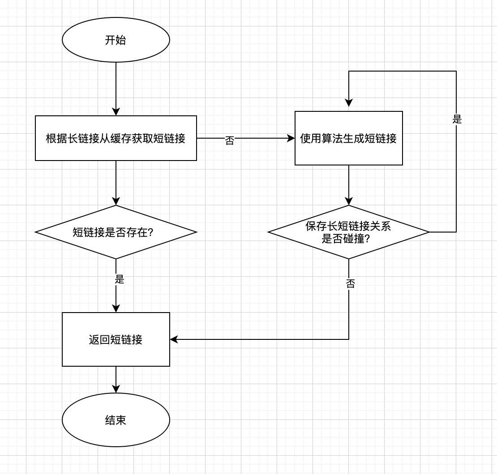

# 短域名服务

## 原始需求
[PRD文档](https://github.com/scdt-china/interview-assignments/tree/master/java)

## 实现目标
### 业务目标
+ 提供两个API接口：   
    短域名存储接口：接受长域名信息，返回短域名   
    短域名读取接口：接受短域名信息，返回长域名
+ 限制：   
    短域名长度最大为 8 个字符

### 技术要求
+ 采用SpringBoot，集成 Swagger API 文档
+ JUnit 编写单元测试，使用 Jacoco 生成测试报告（提供截图）
+ 源代码（生产级编码，使用gitignore过滤） 
+ Jacoco单元测试覆盖率（行覆盖率和分支覆盖率85%+）
+ 文档：完整的设计思路、架构设计图及适当的假设 
+ 系统性能测试方案及测试结果 

### 增值
+ 稳定性
+ 高并发
+ 防攻击
+ 数据统计分析
    
## 概要设计
**工程搭建**
+ 采用Springboot搭建服务，继承swagger、JUnit、Jacoco
+ 采用单体部署，而不是分布式部署
+ 数据采用本地内存存储，配合适当的淘汰策略

**关键点**
+ 62进制的短域名：使用62个字符[A-Z,a-z,0-9]来保存长度为n的短域名。7位的62进制数可以保存3万5千亿个域名，可以满足需求。
+ 短域名格式，采用如 c3.cn/<alias_hash> 格式，其中，alias_hash 是一个固定长度的字符串。alias_hash 作为每一个映射的id，需要维护一个 <ID, url> 的关系。
+ id生成方式：
   - 关系数据库自增id，如mysql；
   - redis INCR自增生成id；
   - hash算法生成id，如google MurmurHash等，需要避免碰撞；
   - 分布式号码生成器生成id，如 Twitter SnowFlake，或自建发号器
   
| 算法 | 描述| 优点 |缺点 |
| --- | --- | --- |--- |
|Snowflake (推荐)| 改造Snowflake算法，确保生成的ID不超过64进制下8位字符 | 高效、分布式 | 默认ID过长，改造后需牺牲并发性能 |
|  本机自增ID| 本机 AtomicLong 实现 | 简单、高效 | 单机、ID有规律 |
|  分部署自增ID| redis自增、数据自增ID都可以实现 | 简单、分布式 | 依赖中间件、ID有规律 |
|MurmurHash | 对原始链接取 Hash 值，可直接用Guava 中的 MurmurHash 实现 | 高效、分布式、ID无规律 | Hash冲突需单独处理 |

    
## 设计思路
短域名服务的核心是给长域名匹配一个合适的短域名，通过长短域名的映射关系实现双向查询。

### 如何生成短域名
1、从缓存中查询长域名是否已经生成过短域名，如果已经生成过，则直接返回缓存中的短域名；   
2、从缓存中查询长域名是否已经生成过短域名，如果没有生成过，则使用算法生成一个短域名，然后保存短域名与长域名的关系，并判断是否碰撞（取决于具体算法），如果有碰撞，则再次算法生成新的短域名，最多重复10次，直到得到合适的短域名。

建立一个发号器，每次有一个新的长URL进来，就增加一，并将新的值返回，相当于实现一个62进制的自增字段即可。

存储？
- 数据量小且qps低，直接数据库自增主键

长短连接一一对应？
- 在内存中做一层缓存，部分实现，如将最近/最热门的对应关系存储在KV数据库中

用map存储“最近”生成的长对短关系，一小时过期机制实现 LRU 淘汰。
a、这个“最近”表中查看一下，看长地址有没有对应的短地址
b、有就直接返回，并且将这个key-value对应过期时间重置为一小时
c、如果没有，就通过发号器生成一个短地址，并且放入这个“最近”表中，过期时间为一小时

+ 1、长度不超过7的字符串，由大小写字母加数字共62个字母组成
+ 2、一个长链接对应一个短链接
+ 3、如何计算短地址？
+ 中小企业：每来一个长链接，就给它发一个自增的号码。可以用一台MySQL自增id方式，也可以使用redis INCR，或者一个Restful api。
+ 大型企业（分布式发号器）：
+ 	- uuid 或 mongodb 的 objectID
+	- 多台MySQL服务器
+	- 分布式ID生成器：Twitter Snowflake
批量发号

+ 4、如何存储？
+	- 传统关系型数据库，MySQL
+	- 分布式KV数据库，如Redis、LevelDB

+ 5、重定向？ 301 or 302

+ 6、预防攻击
+	- 请求签名
+	- 校验位（1位校验位）
+	- 限制ip的单日请求总数，超过阈值则限流，或者直接拒绝服务
+	- 加缓存，LRU机制进行淘汰

## 架构设计图

### 结构设计图

